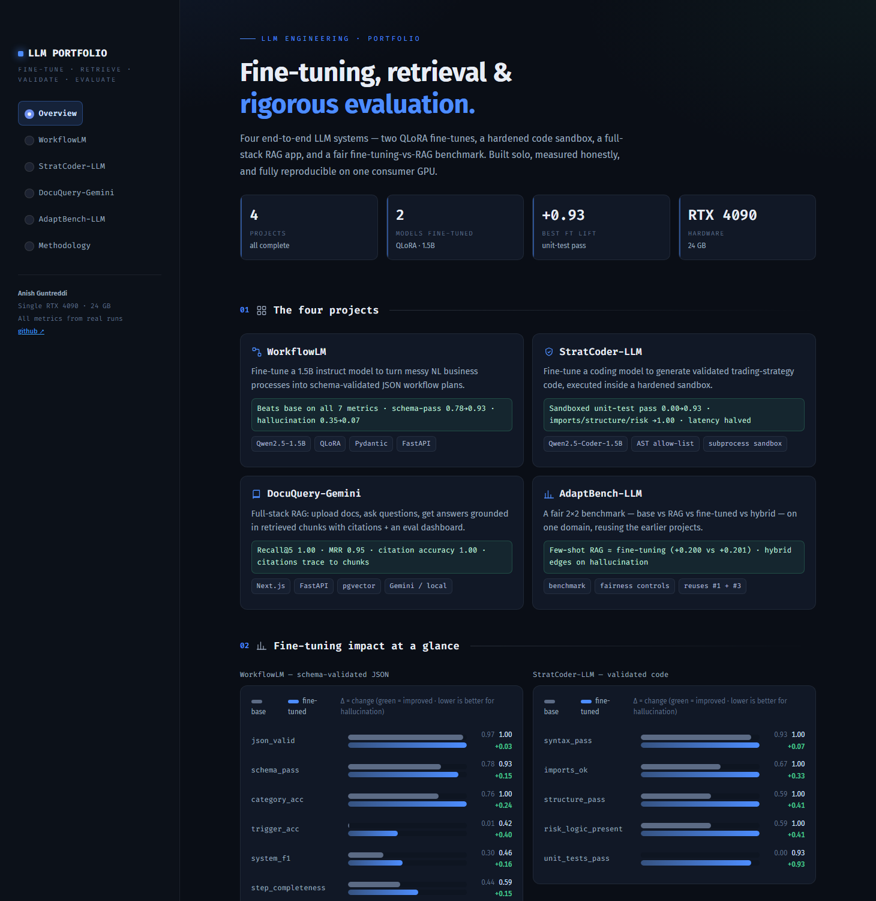

# LLM Engineering Portfolio

Four end-to-end LLM engineering projects spanning fine-tuning, retrieval, code validation, and
rigorous evaluation. Built solo, portfolio-grade, fully reproducible on a single consumer GPU
(developed on an RTX 4090, 24 GB). Every project ships with a real before/after or head-to-head
evaluation — no hand-wavy claims.

### 🌐 **Live showcase site → https://anish-guntreddi.github.io/llm-engineering-portfolio/**

A hand-built static site (GitHub Pages) with the deep project write-ups, architecture, and all the
metrics below — see [`docs/`](./docs). (There's also an interactive Streamlit dashboard further down.)

| # | Project | Headline result | Stack |
|---|---------|-----------------|-------|
| 1 | [**WorkflowLM**](./workflowlm) | QLoRA fine-tune **beats base on all 7 metrics**: schema_pass 0.78→0.93, trigger 0.01→0.42, hallucination 0.35→0.07 | Qwen2.5-1.5B-Instruct, PEFT/TRL, Pydantic, FastAPI |
| 2 | [**StratCoder-LLM**](./stratcoder-llm) | Fine-tune **0.00 → 0.93** sandboxed-unit-test pass rate; imports/structure/risk → 1.00; latency halved | Qwen2.5-Coder-1.5B, AST + import allow-list + subprocess sandbox, FastAPI |
| 3 | [**DocuQuery-Gemini**](./docuquery-gemini) | Full-stack RAG with citation traceability; eval **Recall@5 1.0, MRR 0.95, citation acc 1.0**; security-audited | Next.js, FastAPI, Postgres/pgvector, Gemini (local fallback) |
| 4 | [**AdaptBench-LLM**](./adaptbench-llm) | Fair 2×2 benchmark: **few-shot RAG ≈ fine-tuning** (+0.200 vs +0.201 composite); hybrid edges on hallucination | reuses #1's dataset/validator/adapter + #3's retrieval |

All four are complete and merged to `master`, each on its own development branch with a
portfolio-ready README.

## 📊 Live metrics dashboard

A custom-themed **Streamlit** dashboard ([`streamlit_app.py`](./streamlit_app.py)) visualizes every
project's real metrics, architecture, and training recipe — deployable free on
[Streamlit Community Cloud](https://streamlit.io/cloud).



Design is a deliberate "instrument-panel" system — monospace `Fira Code` for metrics/labels,
numbered section spines, hairline rules, custom comparison bars and a results matrix, SVG icons
(no emoji), and a single accent color story.

```bash
pip install -r requirements.txt
streamlit run streamlit_app.py
```

**Deploy on Streamlit Community Cloud:** sign in at share.streamlit.io with this GitHub account →
*New app* → pick this repo, branch `master`, main file `streamlit_app.py` → Deploy. It needs no
GPU or API keys — it reads the committed result files (`*/results/*.csv|json|png`).

## What each one demonstrates

- **WorkflowLM** — real fine-tuning skill: a schema a 1.5B model can actually learn, a
  self-validating dataset, strict train/val/test discipline, and an honest base-vs-fine-tuned
  comparison where the win comes from *schema consistency*, not raw JSON validity.
- **StratCoder-LLM** — fine-tuning a coding model **plus** a hardened validation layer that safely
  executes model-generated Python (static import allow-list → structure check → sandboxed unit
  tests). Includes a focused [security audit](./stratcoder-llm/SECURITY.md) of the execution path.
- **DocuQuery-Gemini** — full-stack product engineering: ingestion, pgvector retrieval, grounded
  answers whose **citations trace to the exact retrieved chunks**, an honest "I don't know" path,
  a retrieval-evaluation dashboard, per-user scoping, and an OWASP-style
  [security audit](./docuquery-gemini/SECURITY.md) (IDOR, uploads, prompt injection, key handling).
- **AdaptBench-LLM** — research rigor: a fair, reproducible benchmark with explicit fairness
  controls (identical inputs, one scorer, same knowledge source for RAG and FT, leakage guard,
  deterministic + cached), answering *when fine-tuning vs RAG vs hybrid wins* — and reusing the
  earlier projects to do it.

## Cross-project conventions

- Pinned dependencies, fixed seeds, versioned configs for every training/eval run.
- Strict train/val/test split discipline; the validator/scorer is a **single source of truth**
  shared by data generation, evaluation, and serving.
- Metrics computed identically across compared systems; results reported honestly (CSV + markdown),
  including failures and caveats.
- Verified-compatible ML stack (transformers 4.46.3 / trl 0.12.2 / peft 0.14.0 / bitsandbytes
  0.49.2 on CUDA 12.4) — pinned because transformers 5.x / trl 1.x are not yet compatible for this
  QLoRA setup.

See [RETRO.md](./RETRO.md) for what was learned across the sprint.

## Repository layout

```
workflowlm/        # Phase 1 — fine-tuning pipeline + FastAPI
stratcoder-llm/    # Phase 2 — fine-tuning + code-validation sandbox + FastAPI
docuquery-gemini/  # Phase 3 — Next.js + FastAPI + pgvector RAG app
adaptbench-llm/    # Phase 4 — four-system evaluation harness
```
